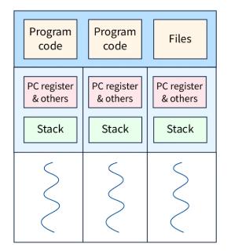

# Table of Contents

- [Table of Contents](#table-of-contents)
- [Solution](#solution)
  - [Identified Bugs](#identified-bugs)
    - [Server Can't Handle More Than One Client](#server-cant-handle-more-than-one-client)
    - [Server Does not Handle an Add Request](#server-does-not-handle-an-add-request)
    - [Server Does not Notify the Client of Failure](#server-does-not-notify-the-client-of-failure)
  - [Solutions Flow](#solutions-flow)
    - [Spawn a Thread For Each Client (No Longer Implemented)](#spawn-a-thread-for-each-client-no-longer-implemented)
    - [Use a Thread Pool to Handle Multiple Clients (Implemented)](#use-a-thread-pool-to-handle-multiple-clients-implemented)
    - [Handle Multiple Messages, Including Sending an Error Message](#handle-multiple-messages-including-sending-an-error-message)
  - [System Tests](#system-tests)
  - [Run Tests](#run-tests)

# Solution
This file explains the steps taken to identify, fix and improve any possible shortcomings to that project. Code documentation, cleanliness, and modularity were of important aspects while writing this code.

## Identified Bugs
The following bugs have been detected after debugging using: a debugger and `println!()` statements at certain points.

### Server Can't Handle More Than One Client
In a case where multiple clients run sequentially, the server would be stuck serving only one. This is due to the following code snippet.
```
// Handle the client request
let mut client = Client::new(stream);
while self.is_running.load(Ordering::SeqCst) {
    if let Err(e) = client.handle() {
        error!("Error handling client: {}", e);
        break;
    }
}
```

Since the server is single threaded, only one client will insert this loop and will not exit as long as the server is running.

### Server Does not Handle an Add Request
```
if let Ok(message) = EchoMessage::decode(&buffer[..bytes_read]) {
    info!("Received: {}", message.content);
    // Echo back the message
    let payload = message.encode_to_vec();
    self.stream.write_all(&payload)?;
    self.stream.flush()?;
} else {
    error!("Failed to decode message");
}
```
It can be clearly seen that there no checks are made to identify the type of request, it is simply assumed to be an `EchoMessage`.

### Server Does not Notify the Client of Failure
Assume the following scenario, the developer creates a client that runs an infinite loop, continuously sending echo messages. If the server was ever to fail for any reason, the client side would be stuck in an infinite loop, waiting for the server to respond as the server never sent a failure message. The following figure further demonstrates that scenario.

<div align="center">


*Figure 1: Visualization of the Server Shut Down Bug*
</div>

It can be seen that the server simply shuts down without notifying the client that it is no longer runnning, and in turn the client waits indefinetly until the server sends a message, which will not happen.

This enforces the client to add a timeout for when waiting for a server response, which opens up a whole new bunch of work.


## Solutions Flow
The following is not a single solution but how the current code ended up and what were the steps that lead to it.

### Spawn a Thread For Each Client (No Longer Implemented)
The approach was simple, a new client means a new thread being spawned. This is very ineffecient for many reasons.

One is that this gives room for a large number of clients to overflow the server with requests.

The other reason is that on the OS level, creating a thread is an expensive operation. This is because the OS has to create a thread control block in memoryeach time a thread is spawned. The structure of a thread control block can be seen in the following figure.

<div align="center">


*Figure 2: The Structure of a Thread Control Block*
</div>

A code sample can also be seen in the following code block.
```
thread::spawn(move || {
    // Create a client instance.
    let mut client = Client::new(stream);

    // The thread will loop indefinitely until the server shuts down or an error occurs.
    while is_running.load(Ordering::SeqCst) {
        if let Err(e) = client.handle() {
            error!("Error handling client: {}", e);
            break;
        }
    }
});
```

### Use a Thread Pool to Handle Multiple Clients (Implemented)
Due to the previously mentioned complications, the better approach for handling multiple clients is to use a limited number of threads using a thread pool. The following code block further shows how a thread pool is used within the server.

```
self.thread_pool.execute( move || {
    // Create a client instance.
    let mut client = Client::new(stream);
    // The thread will loop indefinetly until the serverr shuts down or an error occurs.
    while is_running.load(Ordering::SeqCst) {
        if let Err(e) = client.handle() {
            error!("Error handling client: {}", e);
            break;
        }
    }
});
```
Because of this implementation, now the server has to keep a record of all the connected clients. This is done using a vector that is accessed with a mutex to avoid race conditions. There is a specific code snippet that deserves more explanation.
```
// Add the client to the list of active clients.
{
    self.active_clients.lock().unwrap().push(stream.try_clone().unwrap());
} // Lock is released here.
```
The mutex is accessed within its own separate block. This is because the lock is released when it goes out of scope, so that is the approach to go with.

### Handle Multiple Messages, Including Sending an Error Message
A handler for the add request has been added. Another handler that sends an error message has also been added. Its definition was added to the `messages.proto` file.
```
message ErrorMessage {
    string content = 1;
}
```
The code was also written to be more modular and cleaner by separating each handler in a function, it can be seen in the following snippet.
```
// Decode the message to decide on the type of the request.
if let Ok(client_request) = ClientMessage::decode(&buffer[..bytes_read]) {
    match client_request.message {
        Some(client_message::Message::EchoMessage(echo_message)) => {
            self.handle_echo_request(echo_message);
        } Some(client_message::Message::AddRequest(add_request)) => {
            self.handle_add_request(add_request);
        } None => {
            // In case the received request was not identified, this will execute.
            error!("Bad Request!");
            self.handle_bad_request();
        }
    }
} else {
    // Executes when the decoding of the message fails.
    error!("Failed to decode message");
    self.handle_bad_request();
}
```
Thanks to this approach, the bug previously shown in Figure 2, is now resolved. The following figure shows an updated version that elaborates the same example.

<div align="center">


*Figure 3: Bug No Longer Exists Due to Error Handling*
</div>

**Note**: There is no need to handle a case where the requests exceed the thread pool size as the thread pool already queues all the requests until a thread finishes.

## System Tests
The previous test cases included simple test scenarios which were:
1. Test a client connection.
2. Test one echo message request.
3. Test multiple echo requests for one client.
4. Test multiple echo requests for multiple clients.
5. Test an add request for a single client.

To test the newly added functionalities, the following tests have been implemented:
1. Test for multiple client connections done in parallel.
2. Test for when a client sends a bad request to a server.
3. Test a client that runs in an infinite loop until it receives a server shutdown message.

**Note:** The test where multiple clients run in parallel is special, as it sends both echo and add requests in a for loop and each client handles its own request.

## Run Tests
Since all the tests use the same IP address and port number, they can't run in parallel and therefore need to run sequentailly.

Use the following command to run the tests sequentially:
```
cargo test -- --test-threads=1
```